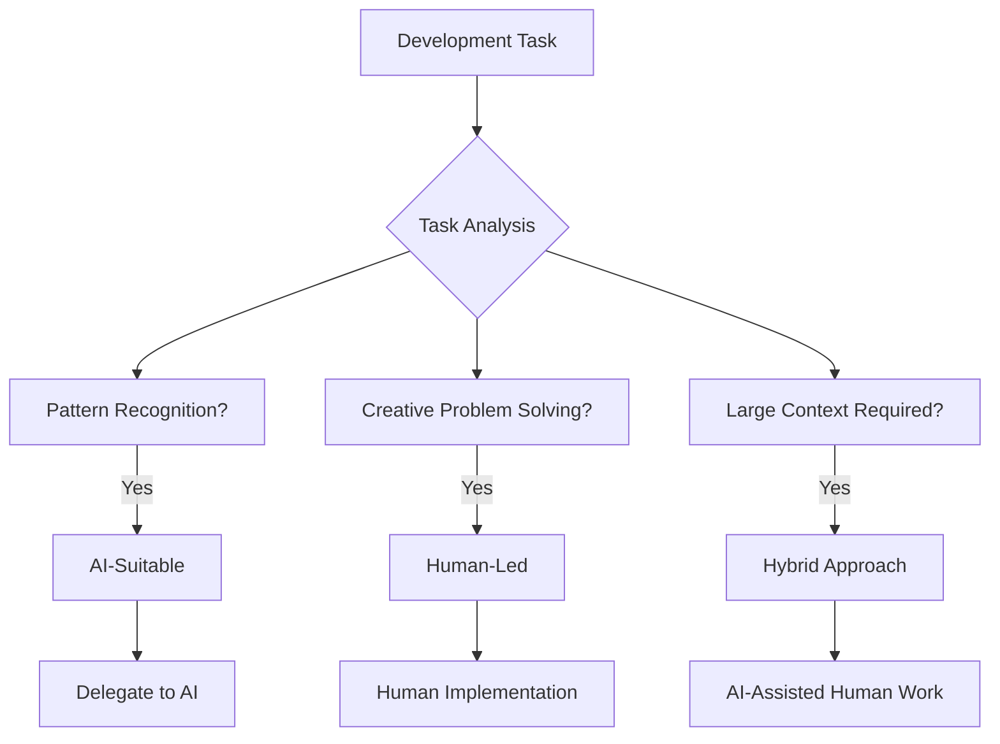

# Agent Workflow Optimization

Learn proven strategies for optimizing your development workflow with AI coding agents, focusing on task breakdown, quality control, and effective human-AI collaboration.

## Understanding AI-Human Collaboration

Effective AI-assisted development isn't about replacing human judgment—it's about amplifying human capabilities through strategic collaboration.

### The Collaboration Spectrum

```
Human-Led ←→ Balanced ←→ AI-Led
    ↑           ↑         ↑
Strategic   Tactical   Routine
Planning    Implementation   Tasks
```

- **Human-Led**: Architecture, requirements, critical decisions
- **Balanced**: Feature implementation, code review, problem-solving
- **AI-Led**: Boilerplate generation, documentation, routine refactoring

## Task Breakdown Strategies

### 1. Complexity-Based Breakdown

#### High Complexity (Human-Led)
- System architecture design
- Security implementation
- Performance optimization
- Cross-service integration

#### Medium Complexity (Collaborative)
- Feature implementation
- API design
- Database schema design
- Component architecture

#### Low Complexity (AI-Led)
- Boilerplate code generation
- Unit test creation
- Documentation generation
- Code formatting and linting

### 2. AI Capability Mapping



### Example Task Breakdown

#### Original Task: "Build User Authentication System"

**Human-Led Components:**
- Security architecture design
- Token strategy selection
- Privacy compliance review
- Integration planning

**AI-Assisted Components:**
- JWT token implementation
- Password hashing utilities
- API endpoint structure
- Error handling patterns

**AI-Led Components:**
- Boilerplate route handlers
- Input validation schemas
- Test case generation
- Documentation generation

## Quality Control Framework

### 1. AI Output Validation

#### Immediate Review Checklist
```bash
# Security Review
□ No hardcoded secrets or credentials
□ Proper input validation
□ SQL injection prevention
□ XSS protection measures

# Logic Review  
□ Edge cases handled
□ Error conditions managed
□ Performance considerations
□ Memory leak prevention

# Standards Review
□ Follows team coding standards
□ Proper naming conventions
□ Adequate documentation
□ Test coverage included
```

#### Automated Quality Gates
```yaml
# .github/workflows/ai-code-review.yml
name: AI Code Quality Review

on:
  pull_request:
    paths: ['src/**/*.js', 'src/**/*.ts']

jobs:
  ai-review:
    runs-on: ubuntu-latest
    steps:
      - name: Security Scan
        run: |
          # Scan for security vulnerabilities
          npm audit
          snyk test
          
      - name: Code Quality Check
        run: |
          # Static analysis
          eslint src/
          sonarqube-scanner
          
      - name: AI-Generated Code Detection
        run: |
          # Custom script to identify AI-generated patterns
          python scripts/detect-ai-code.py
```

### 2. Iterative Refinement Process

#### Step 1: Initial Generation
```bash
# Generate initial implementation
claude-code create src/auth/tokenManager.js \
  "JWT token manager with refresh capabilities"
```

#### Step 2: Review and Refine
```bash
# Analyze the generated code
claude-code review src/auth/tokenManager.js \
  --focus="security,performance,edge-cases"

# Apply specific improvements
claude-code edit src/auth/tokenManager.js \
  "Add rate limiting for token refresh"
```

#### Step 3: Integration Testing
```bash
# Test with existing codebase
claude-code analyze src/auth/ \
  --check-integration

# Generate integration tests
claude-code create tests/auth/integration.test.js \
  "Integration tests for token manager"
```

## Workflow Patterns

### 1. The AI-First Development Pattern

```
1. AI Planning
   ↓
2. Human Validation
   ↓
3. AI Implementation
   ↓
4. Human Review
   ↓
5. Iterative Refinement
```

#### Example Implementation
```bash
# Phase 1: AI Planning
claude-code analyze requirements.md
claude-code create architecture-plan.md \
  "System architecture for user management feature"

# Phase 2: Human Validation
# Review architecture plan with team
# Adjust based on business requirements

# Phase 3: AI Implementation  
claude-code create src/features/user-management/ \
  --based-on=architecture-plan.md

# Phase 4: Human Review
# Code review, testing, security analysis

# Phase 5: Iterative Refinement
claude-code refactor src/features/user-management/ \
  --feedback="performance optimization needed"
```

### 2. The Human-Led with AI Acceleration Pattern

```
1. Human Planning
   ↓
2. AI Task Breakdown
   ↓
3. Parallel Development
   ↓
4. AI-Assisted Integration
   ↓
5. Human Quality Assurance
```

#### Example Implementation
```bash
# Phase 1: Human Planning
# Design system architecture
# Define interfaces and contracts

# Phase 2: AI Task Breakdown
claude-code create development-plan.md \
  --input=architecture.md \
  "Break down into development tasks"

# Phase 3: Parallel Development
# Multiple developers work on different components
# AI assists with implementation details

# Phase 4: AI-Assisted Integration
claude-code integrate src/components/ \
  --resolve-conflicts \
  --maintain-interfaces

# Phase 5: Human Quality Assurance
# Final review, testing, deployment
```

### 3. The Hybrid Pairing Pattern

Real-time collaboration between human and AI during development.

```javascript
// Human writes interface
interface UserService {
  createUser(userData: UserData): Promise<User>;
  updateUser(id: string, updates: Partial<UserData>): Promise<User>;
  deleteUser(id: string): Promise<void>;
}

// AI implements with human guidance
class UserServiceImpl implements UserService {
  // AI generates implementation
  // Human reviews and adjusts in real-time
  async createUser(userData: UserData): Promise<User> {
    // Validation logic (AI-generated, human-reviewed)
    this.validateUserData(userData);
    
    // Database interaction (AI-generated)
    const user = await this.db.users.create({
      ...userData,
      id: generateId(),
      createdAt: new Date(),
    });
    
    // Business logic (human-added)
    await this.sendWelcomeEmail(user);
    
    return user;
  }
}
```

## Performance Optimization

### 1. AI Tool Selection by Task

| Task Type | Primary Tool | Secondary Tool | Reason |
|-----------|-------------|----------------|---------|
| **Real-time Coding** | GitHub Copilot | Cursor AI | Fast completions |
| **Code Analysis** | Claude Code | Cursor AI | Deep understanding |
| **Documentation** | Claude Code | ChatGPT | Comprehensive output |
| **Refactoring** | Cursor AI | Claude Code | Multi-file awareness |
| **Testing** | GitHub Copilot | Claude Code | Pattern recognition |

### 2. Context Optimization

#### Effective Context Provision
```bash
# Good: Specific context
claude-code edit src/api/userRoutes.js \
  --context="Express.js REST API with JWT auth" \
  "Add input validation middleware"

# Better: Rich context  
claude-code edit src/api/userRoutes.js \
  --context="Express.js REST API with JWT auth, using Joi validation, following OpenAPI spec" \
  --related-files="src/middleware/auth.js,src/schemas/user.js" \
  "Add input validation middleware"
```

#### Context Management Strategies
```bash
# Create context files for consistent AI understanding
echo "
Project: E-commerce Platform
Stack: Node.js, Express, PostgreSQL, React
Architecture: Microservices with API Gateway
Auth: JWT with refresh tokens
Testing: Jest + Supertest
Style: ESLint + Prettier
" > .claude-context

# Reference in AI requests
claude-code --context-file=.claude-context create feature
```

### 3. Workflow Automation

#### Custom AI Workflows
```bash
#!/bin/bash
# scripts/ai-feature-workflow.sh

FEATURE_NAME=$1
DESCRIPTION=$2

echo "🤖 Starting AI-assisted feature development..."

# 1. Create feature structure
claude-code create src/features/$FEATURE_NAME/ \
  --template=feature-template \
  "$DESCRIPTION"

# 2. Generate tests
claude-code create tests/features/$FEATURE_NAME/ \
  --based-on=src/features/$FEATURE_NAME/ \
  "Comprehensive test suite"

# 3. Update documentation
claude-code edit docs/features.md \
  "Add documentation for $FEATURE_NAME feature"

# 4. Create API documentation
claude-code create docs/api/$FEATURE_NAME.md \
  --based-on=src/features/$FEATURE_NAME/routes.js \
  "OpenAPI specification"

echo "✅ Feature scaffold complete. Ready for human review."
```

## Measuring Effectiveness

### 1. Productivity Metrics

#### Development Velocity
```bash
# Track lines of code per hour
git log --since="1 week ago" --numstat --pretty=format:"" | \
  awk '{added+=$1; deleted+=$2} END {print "Added:", added, "Deleted:", deleted}'

# Track feature completion time
# Before AI: Average 5 days per feature
# After AI: Average 3 days per feature
# Improvement: 40% faster delivery
```

#### Quality Metrics
```bash
# Defect rate tracking
echo "
Pre-AI Development:
- Bugs per 1000 lines: 2.5
- Time to fix: 4 hours average

AI-Assisted Development:  
- Bugs per 1000 lines: 1.8
- Time to fix: 2.5 hours average
"
```

### 2. Code Quality Analysis

#### Automated Quality Tracking
```javascript
// scripts/quality-metrics.js
const metrics = {
  codeComplexity: calculateComplexity(),
  testCoverage: getTestCoverage(),
  documentationCoverage: getDocCoverage(),
  securityScore: getSecurityScore(),
  performanceScore: getPerformanceScore()
};

// Track trends over time
console.log('Quality Trends:', {
  thisWeek: metrics,
  improvement: compareWithPrevious(metrics),
  aiContribution: estimateAIContribution()
});
```

### 3. Team Satisfaction Metrics

#### Regular Assessment
```yaml
Weekly AI Workflow Review:
  - Productivity improvement: 1-10 scale
  - Code quality satisfaction: 1-10 scale  
  - Learning and growth: 1-10 scale
  - Tool frustration points: Open feedback
  - Workflow optimization ideas: Open feedback
```

## Common Pitfalls and Solutions

### 1. Over-reliance on AI

**Problem**: Developers stop thinking critically about code
**Solution**: 
- Mandate code review of all AI-generated code
- Require explanation of AI suggestions before acceptance
- Regular "AI-free" coding sessions

### 2. Context Loss

**Problem**: AI doesn't understand project-specific patterns
**Solution**:
- Maintain comprehensive context files
- Use project-specific AI prompts
- Regular AI context updates

### 3. Quality Drift

**Problem**: Gradual decline in code quality
**Solution**:
- Automated quality gates
- Regular quality audits
- AI-generated code identification and review

## Advanced Optimization Techniques

### 1. AI Model Fine-tuning

```python
# Example: Fine-tune model for project-specific patterns
from transformers import GPTNeoForCausalLM, GPT2Tokenizer

# Load base model
model = GPTNeoForCausalLM.from_pretrained("EleutherAI/gpt-neo-125M")
tokenizer = GPT2Tokenizer.from_pretrained("EleutherAI/gpt-neo-125M")

# Fine-tune on project codebase
training_data = load_project_code()
fine_tune_model(model, training_data)

# Use for project-specific code generation
```

### 2. Custom AI Assistants

```javascript
// Create project-specific AI assistant
class ProjectAI {
  constructor(projectContext) {
    this.context = projectContext;
    this.patterns = this.loadProjectPatterns();
  }
  
  async generateCode(prompt) {
    const enrichedPrompt = this.addContext(prompt);
    return await this.aiModel.generate(enrichedPrompt);
  }
  
  addContext(prompt) {
    return `
      Project Context: ${this.context}
      Coding Patterns: ${this.patterns}
      User Request: ${prompt}
    `;
  }
}
```

### 3. Workflow Analytics

```sql
-- Track AI usage patterns
CREATE TABLE ai_interactions (
  id SERIAL PRIMARY KEY,
  timestamp TIMESTAMP DEFAULT NOW(),
  tool_used VARCHAR(50),
  task_type VARCHAR(50),
  input_tokens INTEGER,
  output_tokens INTEGER,
  quality_score DECIMAL(3,2),
  time_saved_minutes INTEGER
);

-- Analyze productivity gains
SELECT 
  tool_used,
  AVG(time_saved_minutes) as avg_time_saved,
  AVG(quality_score) as avg_quality,
  COUNT(*) as usage_count
FROM ai_interactions 
WHERE timestamp > NOW() - INTERVAL '30 days'
GROUP BY tool_used;
```

## Future Workflow Evolution

### Emerging Patterns
- **AI-Native Development**: Projects designed around AI capabilities
- **Collaborative AI**: Multiple AI agents working together
- **Predictive Development**: AI anticipating developer needs
- **Autonomous Testing**: AI-driven test generation and execution

### Preparing for the Future
1. **Skill Development**: Focus on AI collaboration skills
2. **Tool Adaptation**: Stay current with AI tool evolution
3. **Process Innovation**: Continuously optimize workflows
4. **Team Training**: Regular AI workflow training sessions

## Conclusion

Optimizing AI-assisted development workflows requires a thoughtful balance of automation and human oversight. The key is to:

1. **Understand AI capabilities** and limitations
2. **Design workflows** that leverage AI strengths
3. **Maintain quality** through systematic review processes
4. **Measure and optimize** continuously
5. **Prepare for evolution** as AI capabilities advance

The most successful teams treat AI as a powerful collaborator that amplifies human capabilities rather than a replacement for human judgment and creativity.